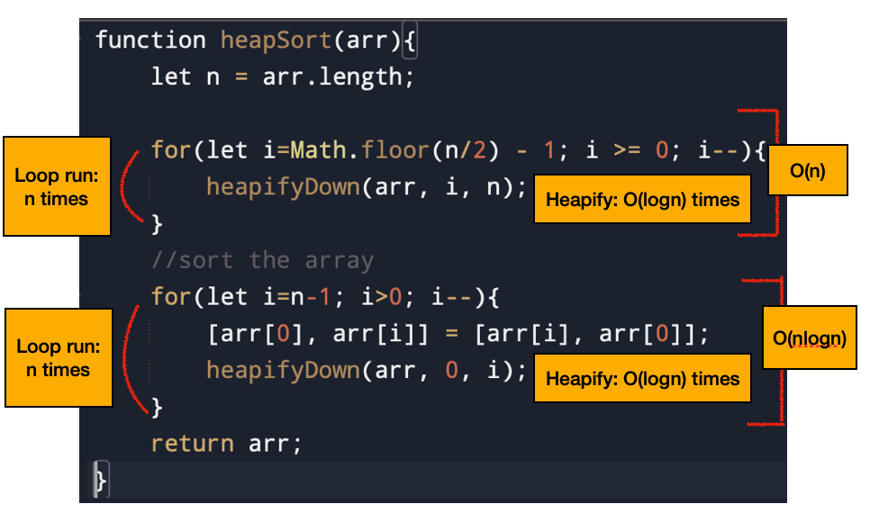
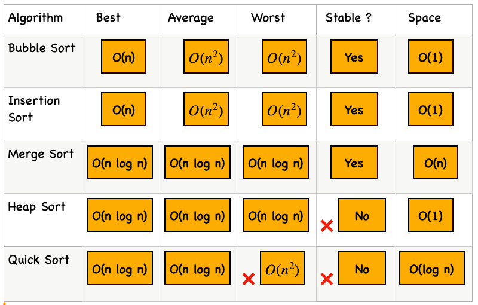

# Heap Sort Algorithm

This document provides a highly visual, plain-English breakdown of the **Heap Sort** algorithm, detailing its in-place mechanics, TypeScript code, and comparison analysis with Quick/Merge Sort.

---

## 📌 1. The Heap Sort Algorithm

**Heap Sort** is an in-place sorting algorithm that uses a binary heap. To sort an array in ascending order, we use a **Max-Heap**.

### Visual Representation of Sorting Steps:
For an unsorted array (e.g. `[10, 4, 5, 1, 3]`):
1.  **Create Max Heap (Phase 1)**:
    *   **Ignore the leaf nodes**: Since leaf nodes ($\approx n/2$ of total nodes $n$) already satisfy the heap property (no children), we do not run heapify on them.
    *   **Run Loop in Reverse**: Start from the last non-leaf node (index $\lfloor n/2 \rfloor - 1$) and iterate backwards down to index 0, running `heapifyDown` at each step to create a Max-Heap.
2.  **Extract & Sort (Phase 2)**:
    *   **Extract maximum element**: The maximum element is always at `arr[0]`.
    *   **Store at end**: Swap `arr[0]` with the last element of the active (unsorted) section.
    *   **HeapifyDown**: Run `heapifyDown` on index 0 to restore the Max-Heap property.
    *   **Repeat**: Decrement active heap size and repeat until the whole array is sorted.
    *   *Output*: `arr = [1, 3, 4, 5, 10]`.

---

## 💻 2. Heap Sort Code (TypeScript)

```typescript
function heapSort(arr: number[]): number[] {
    const n = arr.length;

    // Phase 1: Create a Max-Heap (Ignore leaf nodes, iterate backwards)
    const startIdx = Math.floor(n / 2) - 1;
    for (let i = startIdx; i >= 0; i--) {
        heapifyDown(arr, i, n);
    }

    // Phase 2: Sort the array by extracting elements
    for (let i = n - 1; i > 0; i--) {
        // Swap root (maximum) with the last element
        [arr[0], arr[i]] = [arr[i], arr[0]];
        // Restore Max-Heap on the remaining active heap
        heapifyDown(arr, 0, i);
    }

    return arr;
}

function heapifyDown(arr: number[], i: number, n: number): void {
    let largest = i;
    const left = (2 * i) + 1;
    const right = (2 * i) + 2;

    if (left < n && arr[left] > arr[largest]) {
        largest = left;
    }
            
    if (right < n && arr[right] > arr[largest]) {
        largest = right;
    }

    if (largest !== i) {
        // Swap values using ES6 destructuring
        [arr[i], arr[largest]] = [arr[largest], arr[i]];
        // Recurse down
        heapifyDown(arr, largest, n);
    }
}
```

### Code Complexity Visualizer
The image below highlights the complexity breakdown of each block of the code:



---

## 🔍 3. Heap Sort - Dive Deep & Comparisons

### Time & Space Complexity
*   **Time Complexity**: **$O(N \log N)$** in Best, Average, and Worst cases.
    *   *Build-Heap Phase*: $O(N)$
    *   *Sorting Phase*: We perform $N - 1$ extractions, and each heapifyDown takes $O(\log N)$, yielding $(N - 1) \cdot O(\log N) = O(N \log N)$.
*   **Space Complexity**: **$O(1)$** constant auxiliary space (Heap Sort is performed completely in-place in the input array).

### Comparison Matrix

To see how Heap Sort matches up with other sorting methods, view the summary table below:



---

## ⚖️ 4. Stability in Sorting Algorithms

A sorting algorithm is **stable** if it preserves the original relative order of elements with equal keys.

### The Age-Sort Example
Consider this array of objects:
```javascript
[
    { name: "Rahul", age: 20 },
    { name: "Akshay", age: 18 },  // (A)
    { name: "Simran", age: 18 },  // (B)
    { name: "Sachin", age: 30 }
]
```
If we sort this array in **decreasing order of age**:
*   **Stable Sorting Output**:
    ```javascript
    [
        { name: "Sachin", age: 30 },
        { name: "Rahul", age: 20 },
        { name: "Akshay", age: 18 },  // (A) - original order maintained
        { name: "Simran", age: 18 }   // (B)
    ]
    ```
    Since Akshay (A) was originally before Simran (B) in the input list, a stable algorithm guarantees (A) stays before (B) in the final output.
*   **Unstable Sorting Output**:
    ```javascript
    [
        { name: "Sachin", age: 30 },
        { name: "Rahul", age: 20 },
        { name: "Simran", age: 18 },  // (B) - relative order swapped!
        { name: "Akshay", age: 18 }   // (A)
    ]
    ```
    The relative order of (A) and (B) was swapped during parent-child swaps.

### Modern Environment Support
*   **JavaScript `Array.prototype.sort()`**: Guaranteed to be a **stable** sort (specified since ECMAScript 2019, usually implemented using Timsort).
*   **Heap Sort**: **Unstable**. Elements are swapped across non-contiguous tree branches, violating original input order.

---

## 🔄 5. Step-by-Step Dry Run

We trace `heapSort` on `arr = [10, 4, 5, 1, 3]`.

> [!WARNING]
> **Trace Note & Trap**: In manual tracing, it is a common mistake to compare child nodes with each other first, and swap the parent with the larger child regardless of the parent's value. 
>
> Correct code comparison: `arr[left] > arr[largest]` and `arr[right] > arr[largest]`. If the parent `arr[i]` is already greater than both children, **no swap occurs**.

### Phase 1: Build Max Heap
We check nodes starting from the last non-leaf node: `startIdx = Math.floor(5 / 2) - 1 = 1`.

*   **i = 4**: Leaf node. No operations. `arr = [10, 4, 5, 1, 3]`.
*   **i = 3**: Leaf node. No operations. `arr = [10, 4, 5, 1, 3]`.
*   **i = 2**: Leaf node. No operations. `arr = [10, 4, 5, 1, 3]`.
*   **i = 1** (value 4): Left child is index 3 (value 1), right child is index 4 (value 3).
    *   Compare `arr[3] = 1` and `arr[4] = 3` with parent `4`. Since `4 >= 1` and `4 >= 3`, no swap occurs.
    *   *Manual Trace Variant*: If doing a manual swap trace where parent index 1 swaps with index 4 (value 3) $\rightarrow$ `arr = [10, 3, 5, 1, 4]`.
*   **i = 0** (value 5 or 10):
    *   *Using the standard Max-Heap*: Parent 10 is greater than left child 4 and right child 5. No change.
    *   *Using the variant array `[5, 3, 10, 1, 4]`*: Root is `5`. Left child is `3`, right child is `10`. `10 > 5` $\rightarrow$ swap root with right child `10` $\rightarrow$ `[10, 3, 5, 1, 4]`.

---

### Phase 2: Sorting (Extractions)

Assuming the heap is `[10, 3, 4, 1, 5]` or `[10, 3, 5, 1, 4]`:

#### **Extraction 1 (Heap Size = 5)**:
*   Swap `arr[0]` (10) with last element `arr[4]` (5 or 4) $\rightarrow$ e.g., `[4, 3, 10, 1, 5]` or `[4, 3, 5, 1, 10]`.
*   Run `heapifyDown(0, n=4)` on index 0 (value 4). Children are `3` (idx 1) and `10` or `5` (idx 2).
*   Swap parent with largest child index 2 (value 10 or 5) $\rightarrow$ `[10, 3, 4, 1, 5]` (Heap size reduces to 4, sorted section: `[5]`).

#### **Extraction 2 (Heap Size = 4)**:
*   Swap root `arr[0]` (10) with last element `arr[3]` (1) $\rightarrow$ `[1, 3, 4, 10, 5]`.
*   Run `heapifyDown(0, n=3)` on index 0 (value 1). Children are `3` (idx 1) and `4` (idx 2).
*   Swap parent with largest child index 2 (value 4) $\rightarrow$ `[4, 3, 1, 10, 5]` (Heap size reduces to 3, sorted section: `[10, 5]`).

#### **Extraction 3 (Heap Size = 3)**:
*   Swap root `arr[0]` (4) with last element `arr[2]` (1) $\rightarrow$ `[1, 3, 4, 10, 5]`.
*   Run `heapifyDown(0, n=2)` on index 0 (value 1). Children are `3` (idx 1) and `4` (out of range).
*   Swap parent with largest child index 1 (value 3) $\rightarrow$ `[3, 1, 4, 10, 5]` (Heap size reduces to 2, sorted section: `[4, 10, 5]`).

#### **Extraction 4 (Heap Size = 2)**:
*   Swap root `arr[0]` (3) with last element `arr[1]` (1) $\rightarrow$ `[1, 3, 4, 10, 5]`.
*   Run `heapifyDown(0, n=1)` $\rightarrow$ No change.
*   **Result**: Fully Sorted Array `[1, 3, 4, 5, 10]`.
