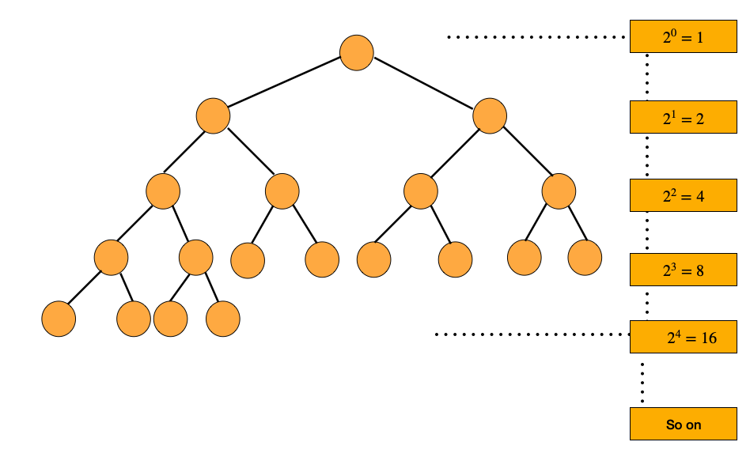

# Introduction to Heaps

This document provides a highly visual, plain-English breakdown of **Heaps**, exploring the binary heap data structure, tree properties, array representation formulas, and invariants.

---

## 📌 1. What is a Heap?

A **Heap** is a specialized tree-based data structure that satisfies two main properties:
1.  **Shape Property (Complete Binary Tree)**: A heap is always a **complete binary tree**.
2.  **Heap Invariant (Ordering Property)**: The keys stored in the nodes must follow a specific order relative to their parent nodes:
    *   **Max-Heap**: The parent's value is greater than or equal to its children's values. The root node `heap[0]` stores the maximum element ($O(1)$ retrieval).
    *   **Min-Heap**: The parent's value is less than or equal to its children's values. The root node `heap[0]` stores the minimum element ($O(1)$ retrieval).

### Complete Binary Tree vs. Full Binary Tree

To master tree structures, remember the distinction between these terms:

*   **Complete Binary Tree**: During a level order traversal, there are **no missing nodes**. All levels are completely filled except possibly the last level, which must be filled from left to right.
    *   Nodes at the last level are arranged contiguously as far left as possible with no gaps (e.g., there cannot be a right child without a corresponding left child).
    *   All Heaps are complete binary trees. This structure guarantees a compact representation.
*   **Full Binary Tree**: In standard terminology, every node has either 0 or 2 children (no node has exactly 1 child). In some instructional contexts, it is defined as a tree where at every level, all nodes are present, and the number of nodes at each level $h$ is $2^h$ (where $h$ is the level index starting at 0).



### Key Node Properties in a Complete Binary Tree
*   **Leaf Node Abundance**: In a complete binary tree of size $N$, there are exactly $\lceil N/2 \rceil$ leaf nodes (occupying the indices from $\lfloor N/2 \rfloor$ to $N - 1$).
*   **Zero-Operation Leaves**: During the `buildHeap` operation, we start from the last non-leaf node and iterate backwards. We do **zero operations** for leaf nodes because they have no children to heapify down into.

---

## 🔄 2. Array Representation & Index Mapping

We primarily use **arrays** to represent heaps because they lack empty spots (no gaps). However, heaps can also be represented using standard node objects with pointers/references (`left`, `right`, `parent`).

When using a flat array, missing nodes or empty spaces in a general binary tree are typically represented by `#`. For a complete binary heap, no `#` values are needed between active nodes.

```text
Tree Layout:
           10 (idx 0)
         /    \
     15 (idx 1) 30 (idx 2)
     /    \
  40 (idx 3) 50 (idx 4)

Array Representation:
idx:    0    1    2    3    4
val:  [10,  15,  30,  40,  50]
```

### Index Mapping Formulas

Depending on whether the array is 0-indexed or 1-indexed, the parent-child index formulas differ:

#### Zero-Indexed Array (Standard in JS/TS)
Given a node at index `i`:
*   **Left Child Index**:
    $$\text{left}(i) = 2 \cdot i + 1$$
*   **Right Child Index**:
    $$\text{right}(i) = 2 \cdot i + 2$$
*   **Parent Index**:
    $$\text{parent}(i) = \left\lfloor \frac{i - 1}{2} \right\rfloor$$

#### One-Indexed Array
Given a node at index `i`:
*   **Left Child Index**:
    $$\text{left}(i) = 2 \cdot i$$
*   **Right Child Index**:
    $$\text{right}(i) = 2 \cdot i + 1$$
*   **Parent Index**:
    $$\text{parent}(i) = \left\lfloor \frac{i}{2} \right\rfloor$$

---

## 💡 3. Min-Heap vs Max-Heap Invariants

Here is how the ordering properties map out visually:

### Max-Heap (Descending Parent Invariant)
Every parent node is greater than or equal to its children.
```text
           100
          /   \
        19     36
       /  \    / \
      17   3  25  1
```
*   *Root*: `100` (max element).
*   *Invariant Check*: Node `19` is parent of `17` and `3`. `19 >= 17` and `19 >= 3` (Valid).

### Min-Heap (Ascending Parent Invariant)
Every parent node is less than or equal to its children.
```text
            1
          /   \
        2       3
       / \     / \
      17  19  36  25
```
*   *Root*: `1` (min element).
*   *Invariant Check*: Node `2` is parent of `17` and `19`. `2 <= 17` and `2 <= 19` (Valid).

---

## 📊 4. Heap Complexity Matrix

*   **Find Min / Max**: **$O(1)$** (always located at the root `heap[0]`).
*   **Insert**: **$O(\log N)$** (requires bubble-up / heapifyUp traversal).
*   **Delete / Extract**: **$O(\log N)$** (requires bubble-down / heapifyDown traversal).
*   **Search**: **$O(N)$** (unsorted linear scan).
*   **Heap Sort**: **$O(N \log N)$** (building heap and extracting all elements).

### Advantages & Disadvantages of Heaps

#### Advantages
*   **Instant Access to Extreme Elements**: In a Min-Heap, finding the smallest element takes **$O(1)$** time. In a Max-Heap, finding the largest element takes **$O(1)$** time.
*   **Efficient Dynamic Updates**: Inserting or deleting elements takes logarithmic **$O(\log N)$** time, which is highly efficient for streaming datasets.
*   **In-Place Sort Support**: Heaps can be used to sort arrays in-place with **$O(1)$** auxiliary space and a guaranteed **$O(N \log N)$** runtime (Heap Sort).

#### Disadvantages
*   **Lack of Flexibility**: Heaps only give fast access to the minimum/maximum element. Finding any other arbitrary element (e.g., the median, or checking if a value exists) requires a linear search (**$O(N)$** time).
*   **Complex Iteration**: Iterating through the array representation does not yield a sorted sequence (only the root is guaranteed sorted). You must repeatedly extract elements to get a sorted output.
*   **Tricky to Implement**: Restructuring node indices and pointers during heapify up and down requires careful index logic to prevent off-by-one errors.
