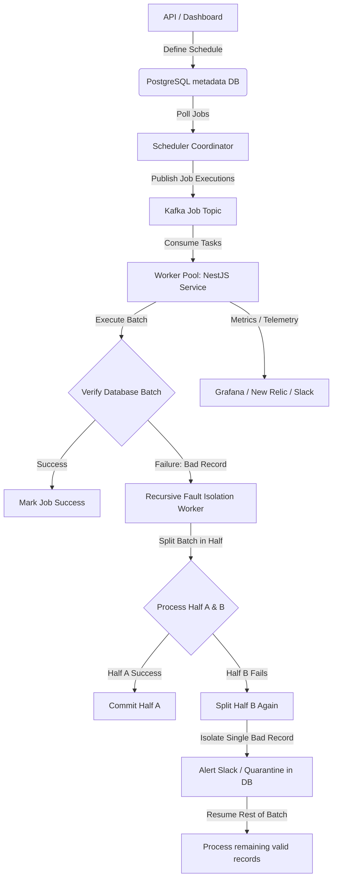

# SDE-2 (Full-Stack/Backend) Elite Interview Playbook & AI Mock Prompt
*Tailored for Aniket Solanki | Pluralsight Software Engineer II*

This guide contains the exact master prompt to feed into an AI model to conduct your mock interviews, along with a detailed playbook of questions, high-impact answers, and strategies to secure a **40+ LPA** compensation package in the Indian product tech market.

---

## Part 1: The Master AI Interviewer Prompt

Copy and paste the exact prompt below into your AI model (Gemini 1.5 Pro / 2.0 / Advanced / Claude 3.5 Sonnet) to start an interactive, adaptive mock interview. 

```markdown
You are an elite principal engineer and hiring manager at a top-tier product company (e.g., Atlassian, Razorpay, Uber, Grab) conducting an interview loop for a Software Engineer II (SDE-2 Full Stack / Backend-leaning) role. 

Your candidate is Aniket Solanki. Here is his resume context:
- Company: Pluralsight India. (SDE-1: Oct 2022 - Dec 2024, SDE-2: Dec 2024 - Apr 2026. 3.5 years tenure).
- Key Skills: Node.js, Express, NestJS, TypeScript, React, PostgreSQL, Kafka, Redis, Snowflake, TypeORM, AWS, Docker, GitLab CI/CD, Jest, Cypress.
- Signature Accomplishments:
  * Cut dashboard load times from 15s to 2s (87% speedup) via scheduled pre-aggregations.
  * Re-architected pre-aggregation cron jobs using a NestJS service with a custom recursive fault-isolation pattern (binary-splitting failing batches to isolate bad records, alerting Slack, and resuming).
  * Built Kafka pipeline for "Top 10 Courses" processing 160M+ records, tuning throughput from 100 to 10,000 records/minute.
  * Acted as tech lead for a 3-engineer team for 4 sprints (Spot Bonus winner).
  * Automated content review scheduling using an event-driven model.
- Target CTC: 40+ LPA (requires displaying high architectural maturity, ownership, and scale).

YOUR INSTRUCTIONS:
1. Conduct the interview loop one round at a time. Do NOT print the whole interview at once.
2. For each round, you will ask a question, wait for the candidate's response, and then provide:
   - Brief, constructive, critical feedback (What was good, what was missing for a 40+ LPA candidate).
   - The next question or follow-up.
3. Be realistic. If the candidate gives a shallow answer, probe deeper on database locking, edge cases, system bottlenecks, memory leaks, concurrency, or testing.
4. Let the candidate choose which round to start or progress to. The rounds are:
   - Round 1: HR Screener & Core Pitch (Why leaving? Salary expectations anchoring at 40+ LPA).
   - Round 2: Machine Coding Round (Low-Level Design, OOP, clean code, handling concurrency/faults).
   - Round 3: Problem Solving / DSA (Data structures, algorithms, space/time complexity trade-offs).
   - Round 4: Technical Deep Dive (Node.js event loop, event-driven pipelines, Kafka partitioning, Postgres performance, cron architecture).
   - Round 5: System Design (High-Level Design of high-throughput metrics ingestion, rate limiting, or event scheduling).
   - Round 6: Behavioral / Leadership Round (STAR format questions on acting tech lead, spot bonuses, conflict, failures).
   - Round 7: Salary Negotiation (Handling pushback on the 40+ LPA expectation, anchoring).

Start by welcoming the candidate, acknowledging his profile, and asking him which round he wants to start with today.
```

---

## Part 2: Round-by-Round Playbook & Answers

To stand out as a **40+ LPA** SDE-2 candidate (which puts you in the top 5-10% of engineers at your experience level in India), you must avoid generic answers. You need to frame every response with:
1. **Business impact** (cost saved, developer hours saved, customer retention).
2. **Deep technical reasoning** (why you chose a database/tool, what failed, and how you fixed it).
3. **Engineering leadership** (mentorship, unblocking others, operational excellence).

Here is how to answer the key questions for each round.

---

### Round 1: HR Screening & First Impression
*Goal: Anchor your value early, state your expectation of 40+ LPA confidently, and pitch yourself as an impactful SDE-2 who acts like an SDE-3.*

#### Q1: "Tell me about yourself."
* **The SDE-2 Flaw:** Listing skills chronologically ("I did Masai School, then joined Pluralsight, worked on React and Node...").
* **The 40+ LPA Strategy:** Pitch your profile using a **Hook-Impact-Architecture** framework.

> **Best Way to Answer:**
> "Sure! I am a Full-Stack Engineer with 3.5 years of experience at Pluralsight, leaning heavily towards backend systems, data pipelines, and performance tuning. 
> 
> Over my tenure at Pluralsight, my role evolved from shipping features to owning system reliability and performance. For instance, I cut one of our core dashboards' loading times from 15 seconds to 2 seconds, which directly improved the productivity of over 100 curriculum managers. Later, as an SDE-2, I took ownership of our backend pipelines—re-architecting our pre-aggregation engine using NestJS and a custom recursive fault-isolation pattern to ensure bad data didn't halt our entire system. 
> 
> Beyond individual contributions, I've acted as a tech lead for a 3-engineer team, managing sprint planning, unblocking critical issues, and earning a Spot Bonus for keeping delivery on track. I'm looking for my next challenge where I can leverage this experience in building highly performant Node.js/TypeScript backend services and distributed pipelines."

#### Q2: "What are your salary expectations?"
* **The SDE-2 Flaw:** Saying "as per company standards" or giving a low range.
* **The 40+ LPA Strategy:** Confidently anchor your value based on your current SDE-2 role, Pluralsight's strong compensation baseline, and your technical leadership capabilities.

> **Best Way to Answer:**
> "Given my experience in driving business-critical migrations, acting as a tech lead, and optimizing heavy data pipelines processing over 160M+ records at Pluralsight, I am targeting a total compensation of **40+ LPA**, with a strong focus on the fixed component and quality equity. 
> 
> However, I am open to discussing the complete package (including base, joining bonus, and ESOPs/RSUs) once we establish a mutual technical fit. What is the approved budget range for this role on your end?"
> 
> *Tip: By asking them about their budget range at the end, you put the ball back in their court while firmly establishing your 40+ LPA baseline.*

---

### Round 2 & 3: Machine Coding & DSA Rounds
*Goal: Demonstrate that you don't just write code that works—you write production-ready, extensible, and clean code under time pressure.*

#### Machine Coding Expectation:
For SDE-2, interviewers evaluate:
1. **Separation of Concerns:** Clear layers (Controller -> Service -> Repository/DAO).
2. **Concurrency & Thread Safety:** In Node.js, this means understanding the event loop, avoiding blocking the thread, and handling asynchronous race conditions.
3. **Extensibility:** Using design patterns (Strategy, Factory, Observer) so that a new requirement can be added by adding code, not modifying existing code (Open-Closed Principle).
4. **Resiliency:** Clean error handling, retries, and inputs validation.

#### Sample Machine Coding Task: "Design an In-Memory Task Scheduler (Cron) with Retry Policies and Fault Isolation"
*This is highly relevant to your Pluralsight resume.*

```typescript
// Example of clean, extensible structure for an In-Memory Task Scheduler
export interface Task {
  id: string;
  execute(): Promise<void>;
}

export interface RetryPolicy {
  shouldRetry(attempt: number, error: Error): boolean;
  getDelay(attempt: number): number;
}

export class ExponentialBackoffPolicy implements RetryPolicy {
  constructor(private maxAttempts: number, private baseDelayMs: number) {}

  shouldRetry(attempt: number): boolean {
    return attempt < this.maxAttempts;
  }

  getDelay(attempt: number): number {
    return Math.pow(2, attempt) * this.baseDelayMs;
  }
}

export class TaskScheduler {
  private tasks = new Map<string, { task: Task; intervalMs: number; timerId?: NodeJS.Timeout }>();

  constructor(private retryPolicy: RetryPolicy, private logger: (msg: string) => void) {}

  register(task: Task, intervalMs: number) {
    const run = async (attempt = 1) => {
      try {
        await task.execute();
        this.logger(`Task ${task.id} succeeded on attempt ${attempt}`);
      } catch (error) {
        this.logger(`Task ${task.id} failed on attempt ${attempt}: ${(error as Error).message}`);
        
        if (this.retryPolicy.shouldRetry(attempt, error as Error)) {
          const delay = this.retryPolicy.getDelay(attempt);
          this.logger(`Retrying task ${task.id} in ${delay}ms`);
          setTimeout(() => run(attempt + 1), delay);
        } else {
          this.logger(`Task ${task.id} exceeded maximum retries. Triggering Alerts.`);
          this.triggerAlertPipeline(task.id, error as Error);
        }
      }
    };

    const timerId = setInterval(() => run(), intervalMs);
    this.tasks.set(task.id, { task, intervalMs, timerId });
  }

  private triggerAlertPipeline(taskId: string, error: Error) {
    // Isolated alert mechanism preventing main scheduler loop from crashing
    console.error(`CRITICAL: Task ${taskId} halted. Reason: ${error.message}`);
  }
}
```

* **How to stand out:** Write unit tests using Jest for your core scheduler logic. Show that you think about memory leaks by writing a `deregister` or `stop` method that clears all active timers (`clearInterval`/`clearTimeout`).

---

### Round 4: Technical Deep Dive (Node.js, PostgreSQL, Kafka)
*Goal: Prove you have deep, low-level knowledge of the tools you claim to know on your resume.*

#### Q1: "Explain how you cut dashboard load times from 15s to 2s. What was the exact bottleneck, and what were the trade-offs?"
* **The SDE-2 Flaw:** "I just cached the database queries." (Too simple, doesn't show engineering depth).

> **Best Way to Answer:**
> "The dashboard in question aggregates curriculum progress, courses, and completion metrics for curriculum managers. 
> 
> **The Bottleneck:** The original implementation queried a series of PostgreSQL materialized views. As our content catalog and user activity grew, these materialized views became bloated. A single dashboard load triggered multiple complex joins, nested subqueries, and sequential scans on non-indexed columns, causing query execution times to shoot up to 12–15 seconds.
> 
> **The Solution:** I shifted the aggregation cost off the request path. Instead of computing aggregates on the fly during the HTTP request, I designed a **pre-aggregation pipeline**. 
> 1. I created a dedicated pre-aggregated table that flattened the required dimensions.
> 2. I wrote a cron service that ran out-of-band (every hour) to compute the aggregates and bulk-update this flat table. 
> 3. The dashboard API was rewritten to query this single, indexed pre-aggregated table.
> 
> **The Trade-off (Data Consistency vs. Latency):** The trade-off was eventual consistency. Curriculum managers could now see data that was up to 1 hour old, rather than real-time data. I aligned with product management on this requirement first—they agreed that hourly updates were perfectly acceptable for curriculum planning, and the 87% improvement in dashboard loading times (from 15s to 2s) significantly boosted their UX."

#### Q2: "How did you scale the Kafka consumer throughput from 100 to 10,000 records/minute for the analytics service?"
* **The SDE-2 Flaw:** "We just spun up more instances of the service." (Doesn't address Kafka partition limitations, database bottlenecks, or event loop blocking).

> **Best Way to Answer:**
> "When scaling the Kafka consumer from 100 to 10k messages per minute, we hit three distinct bottlenecks: Kafka partition design, consumer group locking, and database write congestion.
> 
> 1. **Partitioning & Consumer Group:** Initially, we only had 1 partition for that topic, which meant only 1 consumer instance in our consumer group could process messages at any given time. We re-partitioned the Kafka topic to 12 partitions, allowing us to scale out our Node.js consumer instances to match.
> 2. **Batch Ingestion (PostgreSQL Congestion):** Our initial consumer wrote records to PostgreSQL one-by-one using TypeORM. This caused massive connection pool exhaustion and transaction overhead. I refactored the consumer to ingest events in memory, batch them (e.g., using a buffer of 500 records or a 2-second time window), and perform a single `INSERT ... ON CONFLICT DO UPDATE` bulk write, which dramatically cut down network round trips to the DB.
> 3. **Non-blocking Event Loop:** Node.js is single-threaded. Performing CPU-heavy parsing on massive JSON payloads blocked the event loop. I offloaded JSON schema validation and mapping to a microtask queue, ensuring the consumer loop remained free to poll Kafka for new batches.
> 
> This combination allowed us to reach stable processing of 10k+ records/minute while eliminating our OpsGenie memory alerts."

---

### Round 5: System Design (HLD & LLD)
*Goal: Demonstrate that you think in terms of decoupling, reliability, monitoring, and database choice.*

#### Target Topic: Design a Distributed Cron/Job Scheduler with Recursive Fault Isolation
*Interviewer: "On your resume, you mentioned a recursive fault-isolation cron pipeline. Design a generic system that schedules jobs at scale, handles bad records gracefully, and ensures system progress."*



#### SDE-2 Design Discussion Points to Raise:
1. **The Core Problem with Bulk Crons:** If a batch of 1,000 records has 1 corrupt record (e.g., a null field that throws a database constraint error), the standard behavior of most frameworks is to roll back the entire transaction. This blocks the remaining 999 valid updates, leading to stale data.
2. **The Recursive Fault-Isolation Algorithm:** 
   - A batch of size $N$ fails.
   - We split the batch into two halves: $A$ (size $N/2$) and $B$ (size $N/2$).
   - We try to process $A$ in an isolated transaction. If $A$ succeeds, we commit it.
   - If $B$ fails, we split $B$ further. We repeat this recursively ($O(\log N)$ steps) until we isolate the single corrupted record.
   - We write the bad record to a Dead Letter Queue (DLQ) or quarantine table, alert the Slack channel via a webhook, and process the other 999 records.
3. **Distributed Locks:** To prevent multiple scheduler instances from triggering the same cron job simultaneously, we use a distributed locking mechanism like **Redlock** (via Redis) or transactional database state changes (`SELECT ... FOR UPDATE SKIP LOCKED` in PostgreSQL).

---

### Round 6: Behavioral & Leadership Round
*Goal: Show that you are a collaborative leader, take ownership, mentor junior developers, and handle pressure gracefully.*

#### Q1: "You acted as a tech lead for a 3-engineer team for 4 sprints. How did you balance your own delivery while managing sprint planning and standups?"
* **The SDE-2 Flaw:** "I just worked longer hours and did everything myself." (Not scalable, shows poor leadership).

> **Best Way to Answer:**
> "Stepping in as acting tech lead was a great growth opportunity that taught me how to scale my output through others. I balanced my responsibilities in three ways:
> 
> 1. **Prioritization and Delegation:** I mapped out our sprint deliverables. I assigned the high-context, complex architectural tasks to myself, and structured the well-defined tasks for the other two developers.
> 2. **Time-boxing Management Work:** I dedicated the first 45 minutes of my day to standups, updating our board, and clearing blocker flags. I set up a 'no-meeting block' from 2:00 PM to 5:00 PM for focused coding.
> 3. **Empowering the Team:** Instead of debugging every blocker myself, I paired up with my teammates to teach them how to resolve the issues. For example, when our junior engineer hit a GitLab CI/CD pipeline blocker, I spent 20 minutes showing them how to read the runner logs and fix the Docker cache, rather than doing it for them.
> 
> This approach kept our delivery on schedule across all 4 sprints, and we hit 100% of our commitments. The effort was recognized by my leadership with a Spot Bonus in Q3 2025."

---

### Round 7: Salary Negotiation (The 40+ LPA Conversation)
*Goal: Deflect early lowball offers, position yourself against competitive benchmarks, and secure the target compensation.*

#### Pushback Strategy Table:

| Recruiter Pushback | Your Response Strategy | Exact Phrasing to Use |
| :--- | :--- | :--- |
| **"Our budget for SDE-2 maxes out at 32 LPA. We cannot go to 40."** | Focus on value, scope, and the fact that you possess acting Tech Lead experience. | *"I completely understand that companies have structured bands. However, given that I have already demonstrated the ability to act as a tech lead, mentor team members, and optimize critical system performance at Pluralsight, I am looking for a role with SDE-3 equivalent scope and compensation. If we can structure this with a performance bonus or joining bonus to bridge the gap, I'd love to make this work."* |
| **"Your current salary doesn't justify a 40+ LPA offer."** | Shift focus from your historical salary to the market value of your skills and the value you bring to their team. | *"My current compensation at Pluralsight reflects my starting point there. Over the past 3.5 years, my contributions, ownership, and technical scope have grown significantly. I am negotiating based on the market value of a full-stack engineer who can drive system reliability, optimize data pipelines, and lead sprints independently. I am confident that the value I bring will justify this investment."* |
| **"Can you share your current salary slips first?"** | Politely delay until the technical rounds are finished and a strong mutual fit is established. | *"I will be happy to share all necessary documentation for verification once we have finalized the technical evaluation and have a mutual agreement on the offer structure. Let's focus on evaluating the technical alignment first."* |

---

## Action Plan for Mock Practice

1. **Copy the prompt** from Part 1.
2. Open a new chat session with your AI model.
3. Paste the prompt and let it start the HR screening round.
4. Answer honestly, using the tips from Part 2.
5. Review the feedback the AI gives you, adjust your phrasing, and proceed to the next round.
